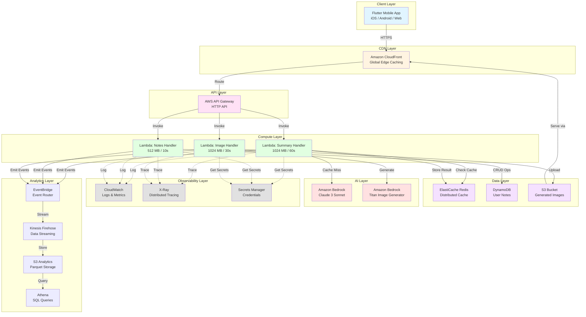

# Design Document: Flashbook AI - Intelligent Book Learning Platform

## Overview

Flashbook AI is a serverless, AI-powered learning platform that transforms traditional books into engaging, structured learning experiences. The system leverages AWS services to provide a scalable, cost-effective, and reliable backend for a Flutter mobile application.

### Core Value Proposition

- **AI-Powered Transformation**: Converts dense book chapters into 5-8 digestible learning slides with narrative structure
- **Visual Learning**: Generates contextual images using AI to enhance comprehension and retention
- **Persistent Annotations**: Enables users to capture insights and review them across devices
- **Global Scale**: Serverless architecture scales from zero to millions of users automatically
- **Cost Efficiency**: Pay-per-use model with aggressive caching minimizes operational costs

### Technology Stack

**Compute & API Layer:**
- AWS API Gateway (HTTP APIs) - RESTful API management
- AWS Lambda (Python 3.11+) - Serverless compute

**AI & Machine Learning:**
- Amazon Bedrock (Claude 3 Sonnet) - Text summarization and content structuring
- Amazon Bedrock (Titan Image Generator) - Visual content generation

**Data Storage:**
- Amazon DynamoDB - User notes and metadata (NoSQL)
- Amazon S3 - Generated images and static assets
- Amazon ElastiCache (Redis) - Distributed caching layer

**Observability & Security:**
- AWS CloudWatch - Logging, monitoring, and alerting
- AWS X-Ray - Distributed tracing
- AWS Secrets Manager - Secure credential storage
- AWS KMS - Encryption key management

**Content Delivery & Analytics:**
- Amazon CloudFront - Global CDN
- Amazon EventBridge - Event-driven analytics
- Amazon Kinesis Data Firehose - Real-time data streaming
- Amazon Athena - Analytics queries

## Architecture

### High-Level System Architecture




### ASCII Architecture Diagram (Terminal Reference)

```
┌─────────────────────────────────────────────────────────────────────┐
│                         Flutter Mobile App                          │
│                      (iOS / Android / Web)                          │
└────────────────────────────┬────────────────────────────────────────┘
                             │ HTTPS
                             ▼
┌─────────────────────────────────────────────────────────────────────┐
│                      Amazon CloudFront (CDN)                        │
│                    - Edge caching for images                        │
│                    - HTTPS termination                              │
└────────────────────────────┬────────────────────────────────────────┘
                             │
                             ▼
┌─────────────────────────────────────────────────────────────────────┐
│                    AWS API Gateway (HTTP API)                       │
│                    - /v1/generateSummary                            │
│                    - /v1/notes (CRUD)                               │
│                    - /v1/generateImage                              │
│                    - /v1/extractText                                │
└────────────────────────────┬────────────────────────────────────────┘
                             │
                             ▼
┌─────────────────────────────────────────────────────────────────────┐
│                       AWS Lambda Functions                          │
│  ┌──────────────┐  ┌──────────────┐  ┌──────────────┐             │
│  │   Summary    │  │    Notes     │  │    Image     │             │
│  │   Handler    │  │   Handler    │  │   Handler    │             │
│  └──────┬───────┘  └──────┬───────┘  └──────┬───────┘             │
└─────────┼──────────────────┼──────────────────┼─────────────────────┘
          │                  │                  │
          │                  │                  │
┌─────▼─────┐      ┌────▼────┐       ┌────▼────┐
│ ElastiCache│      │DynamoDB │       │   S3    │
│   Redis    │      │  Table  │       │ Bucket  │
│  (Cache)   │      │ (Notes) │       │(Images) │
└─────┬──────┘      └─────────┘       └─────────┘
      │
      │ Cache Miss
      ▼
┌──────────────────────────────────────────────┐
│         Amazon Bedrock                       │
│  ┌────────────────┐  ┌────────────────┐     │
│  │ Claude 3 Sonnet│  │ Titan Image    │     │
│  │  (Text Gen)    │  │  Generator     │     │
│  └────────────────┘  └────────────────┘     │
└──────────────────────────────────────────────┘

Observability & Security Layer
┌──────────────────────────────────────────────┐
│  CloudWatch  │  X-Ray  │  Secrets Manager    │
│  (Logs/Metrics) (Traces) (Credentials)       │
└──────────────────────────────────────────────┘

Analytics Pipeline
┌──────────────────────────────────────────────┐
│ EventBridge → Kinesis Firehose → S3 → Athena│
└──────────────────────────────────────────────┘
```


### Request Flow Diagrams

#### Summary Generation Flow (Cache Hit)

```
Flutter App
│
│ POST /v1/generateSummary
│ { book_id, chapter_title, text_chunk, mode }
▼
CloudFront
│
│ (No cache for POST)
▼
API Gateway
│
│ Route to Lambda
▼
Lambda (Summary Handler)
│
│ 1. Validate request (Pydantic)
│ 2. Generate cache key (SHA-256)
│ 3. Check ElastiCache
▼
ElastiCache Redis
│
│ Cache HIT! (< 200ms)
│ Return cached JSON
▼
Lambda
│
│ Deserialize to SummaryResponse
│ Set cached=true
▼
API Gateway
│
│ HTTP 200 + JSON response
▼
Flutter App
│
│ Display 5-8 learning slides
▼
```

#### Summary Generation Flow (Cache Miss)

```
Flutter App
│
│ POST /v1/generateSummary
▼
API Gateway → Lambda
│
│ Cache MISS
▼
Lambda
│
│ 1. Construct prompt with EARS patterns
│ 2. Invoke Bedrock
▼
Amazon Bedrock (Claude 3 Sonnet)
│
│ Generate structured content
│ - 5-8 Content Blocks
│ - Narrative elements (scenes, reveals, insights)
│ - Image hints (max 2)
│ (~ 5-10 seconds)
▼
Lambda
│
│ 1. Parse Bedrock response
│ 2. Validate structure (5-8 blocks)
│ 3. Store in ElastiCache (TTL: 24h)
│ 4. Emit analytics event
▼
ElastiCache Redis
│
│ Store: key → JSON (TTL: 86400s)
▼
Lambda
│
│ Return SummaryResponse (cached=false)
▼
API Gateway → Flutter App
```


#### Notes CRUD Flow

```
Flutter App
│
│ POST /v1/notes
│ { book_id, card_index, card_title, note_text }
▼
API Gateway → Lambda (Notes Handler)
│
│ 1. Validate request
│ 2. Generate UUID
│ 3. Add timestamps (ISO 8601)
▼
DynamoDB Table (flashbook-notes)
│
│ PutItem
│ - Partition Key: id (UUID)
│ - GSI: book_id + card_index
│ (< 10ms)
▼
Lambda
│
│ Return NoteResponse
▼
API Gateway → Flutter App

─────────────────────────────────────

Flutter App
│
│ GET /v1/notes?book_id={id}
▼
API Gateway → Lambda
│
│ Query GSI (book_id)
▼
DynamoDB Table
│
│ Return all notes for book
│ Sorted by card_index
▼
Lambda
│
│ Return NotesListResponse
▼
API Gateway → Flutter App
```

#### Image Generation and Storage Flow

```
Flutter App
│
│ POST /v1/generateImage
│ { image_prompt, book_id, chapter_id }
▼
API Gateway → Lambda (Image Handler)
│
│ 1. Validate prompt (max 500 chars)
│ 2. Invoke Bedrock Titan
▼
Amazon Bedrock (Titan Image Generator)
│
│ Generate image from prompt
│ (~ 3-5 seconds)
▼
Lambda
│
│ 1. Validate size (< 5MB)
│ 2. Generate S3 key
│ 3. Upload to S3
▼
S3 Bucket (flashbook-images)
│
│ Store: images/{book_id}/{chapter_id}/{timestamp}_{hash}.png
│ - Encryption: SSE-S3
│ - Cache-Control: max-age=31536000
▼
Lambda
│
│ 1. Generate CloudFront URL
│ 2. Return ImageResponse
▼
API Gateway → Flutter App
│
│ Display image via CloudFront CDN
▼
```


## Components and Interfaces

### API Gateway Configuration

**Type:** HTTP API (not REST API for cost savings)

**Endpoints:**

```
POST   /v1/generateSummary
POST   /v1/extractText
POST   /v1/generateImage
POST   /v1/notes
GET    /v1/notes/{note_id}
PUT    /v1/notes/{note_id}
DELETE /v1/notes/{note_id}
GET    /v1/notes?book_id={id}
GET    /v1/health
GET    /v1/status
GET    /v1/cache/stats
DELETE /v1/cache/clear
```

**CORS Configuration:**

```json
{
  "allowOrigins": ["*"],
  "allowMethods": ["GET", "POST", "PUT", "DELETE", "OPTIONS"],
  "allowHeaders": ["Content-Type", "Authorization", "X-Request-ID"],
  "maxAge": 3600
}
```

**Throttling:**
- Burst limit: 5000 requests
- Rate limit: 10000 requests/second

**Integration:**
- Type: AWS_PROXY (Lambda proxy integration)
- Timeout: 30 seconds (API Gateway limit)

### Lambda Function Specifications

#### Summary Generation Lambda

**Runtime:** Python 3.11  
**Memory:** 1024 MB  
**Timeout:** 60 seconds  
**Architecture:** ARM64 (Graviton2)  
**Provisioned Concurrency:** 10 (for warm starts)

**Environment Variables:**

```python
BEDROCK_MODEL_TEXT = "anthropic.claude-3-sonnet-20240229-v1:0"
BEDROCK_MODEL_IMAGE = "amazon.titan-image-generator-v1"
REDIS_ENDPOINT = "${ElastiCache.Endpoint}"
CACHE_TTL_SECONDS = "86400"
MIN_SLIDES = "5"
MAX_SLIDES = "8"
MAX_VISUAL_SLOTS = "2"
LOG_LEVEL = "INFO"
```

**IAM Permissions:**
- `bedrock:InvokeModel` (Claude 3 Sonnet, Titan)
- `elasticache:*` (Redis operations)
- `secretsmanager:GetSecretValue`
- `logs:CreateLogGroup`, `logs:CreateLogStream`, `logs:PutLogEvents`
- `xray:PutTraceSegments`, `xray:PutTelemetryRecords`
- `events:PutEvents` (EventBridge analytics)

**Handler Function:**

```python
def lambda_handler(event, context):
    """
    Main entry point for summary generation.
    
    Args:
        event: API Gateway proxy event
        context: Lambda context object
        
    Returns:
        API Gateway proxy response
    """
    # 1. Parse and validate request
    # 2. Check cache
    # 3. If cache miss, invoke Bedrock
    # 4. Store in cache
    # 5. Return response
```

#### Notes Management Lambda

**Runtime:** Python 3.11  
**Memory:** 512 MB  
**Timeout:** 10 seconds  
**Architecture:** ARM64

**Environment Variables:**

```python
DYNAMODB_TABLE_NAME = "flashbook-notes"
DYNAMODB_GSI_NAME = "book-id-index"
LOG_LEVEL = "INFO"
```

**IAM Permissions:**
- `dynamodb:PutItem`, `dynamodb:GetItem`, `dynamodb:UpdateItem`, `dynamodb:DeleteItem`
- `dynamodb:Query` (for GSI)
- `logs:*`, `xray:*`

#### Image Generation Lambda

**Runtime:** Python 3.11  
**Memory:** 1024 MB  
**Timeout:** 30 seconds  
**Architecture:** ARM64

**Environment Variables:**

```python
S3_BUCKET_NAME = "flashbook-images"
CLOUDFRONT_DOMAIN = "${CloudFront.DomainName}"
MAX_IMAGE_SIZE_MB = "5"
```

**IAM Permissions:**
- `bedrock:InvokeModel` (Titan Image Generator)
- `s3:PutObject`, `s3:PutObjectAcl`
- `logs:*`, `xray:*`


### DynamoDB Table Schema

**Table Name:** `flashbook-notes`

**Primary Key:**
- Partition Key: `id` (String, UUID)

**Attributes:**

```
id: String (UUID v4)
book_id: String
card_index: Number
card_title: String
note_text: String (max 5000 chars)
created_at: String (ISO 8601)
updated_at: String (ISO 8601)
```

**Global Secondary Index:**
- Index Name: `book-id-index`
- Partition Key: `book_id` (String)
- Sort Key: `card_index` (Number)
- Projection: ALL

**Capacity Mode:** On-Demand (auto-scaling)

**Encryption:** AWS KMS (default key)

**Point-in-Time Recovery:** Enabled

**TTL:** Not enabled (notes persist indefinitely)

### ElastiCache Redis Configuration

**Cluster Name:** `flashbook-cache`

**Node Type:**
- Development: `cache.t4g.micro` (0.5 GB)
- Production: `cache.r6g.large` (13.07 GB)

**Engine:** Redis 7.0

**Cluster Mode:** Disabled (single shard)

**Multi-AZ:** Enabled (2 replicas in different AZs)

**Automatic Failover:** Enabled

**Backup:**
- Snapshot retention: 7 days
- Snapshot window: 03:00-05:00 UTC

**Maintenance Window:** Sunday 05:00-07:00 UTC

**Parameter Group:**

```
maxmemory-policy: allkeys-lru
timeout: 300
tcp-keepalive: 300
```

**Security:**
- Encryption in transit: Enabled (TLS)
- Encryption at rest: Enabled
- Auth token: Stored in Secrets Manager

### S3 Bucket Configuration

**Bucket Name:** `flashbook-images-{account-id}`

**Versioning:** Enabled

**Encryption:** SSE-S3 (AES-256)

**Lifecycle Policies:**

```json
{
  "Rules": [
    {
      "Id": "TransitionToIntelligentTiering",
      "Status": "Enabled",
      "Transitions": [
        {
          "Days": 30,
          "StorageClass": "INTELLIGENT_TIERING"
        }
      ]
    },
    {
      "Id": "DeleteOldVersions",
      "Status": "Enabled",
      "NoncurrentVersionExpiration": {
        "NoncurrentDays": 90
      }
    }
  ]
}
```

**CORS Configuration:**

```json
{
  "CORSRules": [
    {
      "AllowedOrigins": ["*"],
      "AllowedMethods": ["GET", "HEAD"],
      "AllowedHeaders": ["*"],
      "MaxAgeSeconds": 3600
    }
  ]
}
```

**Access Logging:**
- Target Bucket: `flashbook-logs-{account-id}`
- Prefix: `s3-access-logs/`


### CloudFront Distribution

**Origin:** S3 bucket (`flashbook-images-{account-id}`)

**Alternate Domain Names (CNAMEs):** `images.flashbook.ai`

**SSL Certificate:** AWS Certificate Manager (ACM)

**Cache Behaviors:**

```
Path Pattern: /images/*
- Viewer Protocol Policy: Redirect HTTP to HTTPS
- Allowed HTTP Methods: GET, HEAD, OPTIONS
- Cached HTTP Methods: GET, HEAD
- Cache Policy: CachingOptimized
- TTL: Min=0, Max=31536000, Default=86400
- Compress Objects: Yes (gzip, brotli)

Path Pattern: /v1/health
- Viewer Protocol Policy: HTTPS Only
- TTL: Min=0, Max=60, Default=60
- Forward Headers: None
```

**Origin Failover:**
- Primary: S3 bucket (us-east-1)
- Secondary: S3 bucket replica (us-west-2)

**Geo Restriction:** None

**Logging:**
- Enabled: Yes
- Bucket: `flashbook-logs-{account-id}`
- Prefix: `cloudfront-logs/`

### Secrets Manager Secrets

**Secret 1:** `flashbook/bedrock/credentials`

```json
{
  "aws_access_key_id": "AKIA...",
  "aws_secret_access_key": "...",
  "region": "us-east-1"
}
```

**Secret 2:** `flashbook/redis/connection`

```json
{
  "endpoint": "flashbook-cache.abc123.cache.amazonaws.com",
  "port": 6379,
  "auth_token": "...",
  "ssl": true
}
```

**Rotation:** Automatic (90 days)

**Encryption:** AWS KMS (custom key)


## Data Models

### Request Models (Pydantic Schemas)

#### SummaryRequest

```python
from pydantic import BaseModel, Field, field_validator
from enum import Enum
from typing import Optional

class SummaryMode(str, Enum):
    CHAPTER = "chapter"
    CONCEPT = "concept"
    LAW = "law"

class SummaryRequest(BaseModel):
    """Request for AI-powered book summary generation."""
    
    book_id: Optional[str] = Field(
        default=None,
        description="Optional book identifier for caching and analytics"
    )
    
    chapter_title: Optional[str] = Field(
        default=None,
        max_length=200,
        description="Optional chapter title for context"
    )
    
    text_chunk: str = Field(
        ...,
        min_length=100,
        max_length=15000,
        description="The chapter text to summarize (100-15000 chars)"
    )
    
    mode: SummaryMode = Field(
        default=SummaryMode.CHAPTER,
        description="Summary generation mode"
    )
    
    prev_context: Optional[str] = Field(
        default=None,
        max_length=2000,
        description="Optional previous chapter context for continuity"
    )
    
    next_context: Optional[str] = Field(
        default=None,
        max_length=2000,
        description="Optional next chapter context for continuity"
    )
    
    @field_validator('text_chunk')
    @classmethod
    def validate_text_chunk(cls, v: str) -> str:
        """Ensure text chunk is not just whitespace."""
        stripped = v.strip()
        if len(stripped) < 100:
            raise ValueError("text_chunk must contain at least 100 meaningful characters")
        return stripped
```

#### NoteCreateRequest

```python
class NoteCreateRequest(BaseModel):
    """Request for creating a user note."""
    
    book_id: str = Field(
        ...,
        min_length=1,
        max_length=200,
        description="ID of the book"
    )
    
    card_index: int = Field(
        ...,
        ge=0,
        description="Index of the card in the feed (0-based)"
    )
    
    card_title: str = Field(
        ...,
        min_length=1,
        max_length=500,
        description="Title/headline of the card"
    )
    
    note_text: str = Field(
        ...,
        min_length=1,
        max_length=5000,
        description="The note content"
    )
    
    @field_validator('note_text')
    @classmethod
    def validate_note_text(cls, v: str) -> str:
        """Ensure note text is not just whitespace."""
        stripped = v.strip()
        if len(stripped) < 1:
            raise ValueError("note_text cannot be empty")
        return stripped
```

#### ImageGenerationRequest

```python
class ImageGenerationRequest(BaseModel):
    """Request for AI image generation."""
    
    image_prompt: str = Field(
        ...,
        min_length=10,
        max_length=500,
        description="Detailed prompt for image generation"
    )
    
    book_id: str = Field(
        ...,
        description="Book identifier for organizing images"
    )
    
    chapter_id: Optional[str] = Field(
        default=None,
        description="Optional chapter identifier"
    )
    
    style: Optional[str] = Field(
        default="photographic",
        description="Image style (photographic, digital-art, cinematic)"
    )
```


### Response Models

#### SummaryResponse

```python
class BlockType(str, Enum):
    """Types of content blocks in learning slides."""
    SCENE = "scene"
    REVEAL = "reveal"
    EMOTION = "emotion"
    TENSION = "tension"
    INSIGHT = "insight"
    QUOTE = "quote"
    VISUAL = "visual"
    LYRIC_SCROLL = "lyric_scroll"

class ContentBlock(BaseModel):
    """A single content block in the summary output."""
    
    type: BlockType = Field(
        ...,
        description="The semantic type of this block"
    )
    
    slide_title: str = Field(
        default="",
        max_length=30,
        description="1-2 word slide title (e.g., 'PLOT TWIST', 'INNER CONFLICT')"
    )
    
    headline: str = Field(
        default="",
        max_length=100,
        description="Short punchy headline (5-10 words)"
    )
    
    body: str = Field(
        default="",
        description="Main narrative content of the block"
    )
    
    lyric_lines: list[str] = Field(
        default_factory=list,
        description="Flowing text lines for lyric_scroll blocks"
    )
    
    image_hint: bool = Field(
        default=False,
        description="Whether this block should have an illustration"
    )
    
    image_prompt: str = Field(
        default="",
        max_length=500,
        description="Detailed prompt for image generation if image_hint is true"
    )
    
    image_url: Optional[str] = Field(
        default=None,
        description="CloudFront URL of generated image (if available)"
    )

class GenerationNotes(BaseModel):
    """Metadata about the generation process."""
    
    compression_applied: bool = Field(
        default=False,
        description="Whether the chapter was compressed to fit limits"
    )
    
    long_chapter_handled: bool = Field(
        default=False,
        description="Whether special handling was applied for long content"
    )
    
    context_used_only_for_continuity: bool = Field(
        default=True,
        description="Confirms context was not included in output"
    )

class SummaryResponse(BaseModel):
    """Response for summary generation."""
    
    unit_title: str = Field(
        ...,
        description="Title for this learning unit"
    )
    
    blocks: list[ContentBlock] = Field(
        ...,
        min_length=5,
        max_length=8,
        description="5-8 structured content blocks"
    )
    
    visual_slots_used: int = Field(
        default=0,
        ge=0,
        le=2,
        description="Number of image hints (0-2)"
    )
    
    cached: bool = Field(
        default=False,
        description="Whether this response was served from cache"
    )
    
    notes: GenerationNotes = Field(
        default_factory=GenerationNotes,
        description="Generation metadata"
    )
```

#### NoteResponse

```python
class NoteResponse(BaseModel):
    """Response for note operations."""
    
    id: str = Field(..., description="Unique note identifier (UUID)")
    book_id: str = Field(..., description="ID of the book")
    card_index: int = Field(..., description="Index of the card")
    card_title: str = Field(..., description="Title of the card")
    note_text: str = Field(..., description="Note content")
    created_at: str = Field(..., description="ISO 8601 timestamp of creation")
    updated_at: str = Field(..., description="ISO 8601 timestamp of last update")

class NotesListResponse(BaseModel):
    """Response for listing notes."""
    
    notes: list[NoteResponse] = Field(default_factory=list)
    total: int = Field(default=0, ge=0)
```


### Cache Data Model

**Redis Key Format:**

```
cache:summary:{sha256_hash}
```

**Value Format:** JSON string of SummaryResponse

**TTL:** 86400 seconds (24 hours)

**Example:**

```json
{
  "unit_title": "The Hero's Journey Begins",
  "blocks": [
    {
      "type": "scene",
      "slide_title": "ORDINARY WORLD",
      "headline": "Life before the adventure",
      "body": "Our protagonist lives a mundane existence...",
      "image_hint": true,
      "image_prompt": "A person in a small village, looking at distant mountains..."
    }
  ],
  "visual_slots_used": 1,
  "cached": false,
  "notes": {
    "compression_applied": false,
    "long_chapter_handled": false
  }
}
```

### DynamoDB Item Structure

```json
{
  "id": "550e8400-e29b-41d4-a716-446655440000",
  "book_id": "the-alchemist",
  "card_index": 3,
  "card_title": "The Hero's Journey Begins",
  "note_text": "This reminds me of Joseph Campbell's monomyth...",
  "created_at": "2024-01-15T10:30:00Z",
  "updated_at": "2024-01-15T10:30:00Z"
}
```


## Correctness Properties

*A property is a characteristic or behavior that should hold true across all valid executions of a system—essentially, a formal statement about what the system should do. Properties serve as the bridge between human-readable specifications and machine-verifiable correctness guarantees.*

### Property 1: Summary Response Structure Validation

*For any* valid Summary_Request, the generated SummaryResponse should contain between 5 and 8 Content_Block items, and the visual_slots_used field should be at most 2.

**Validates: Requirements 3.1, 3.9, 3.10**

### Property 2: Cache Key Determinism

*For any* two Summary_Request objects with identical book_id, chapter_title, text_chunk, and mode fields, the generated Cache_Key should be identical (deterministic hashing).

**Validates: Requirements 5.2, 20.9**

### Property 3: Cache Serialization Round-Trip

*For any* SummaryResponse object, serializing it to JSON using Pydantic model_dump() and then deserializing it back using Pydantic model validation should produce an equivalent SummaryResponse object.

**Validates: Requirements 5.6, 5.7**

### Property 4: Cached Response Flag

*For any* Summary_Request that hits the cache, the returned SummaryResponse should have the `cached` field set to true.

**Validates: Requirements 5.4**

### Property 5: Cache Population After Generation

*For any* Summary_Request that results in a Bedrock invocation (cache miss), the response should be stored in ElastiCache with the correct Cache_Key and a TTL of 86400 seconds.

**Validates: Requirements 5.5**

### Property 6: UUID Uniqueness for Notes

*For any* two NoteCreateRequest operations, the generated Note_Entity.id fields should be different (UUID v4 uniqueness).

**Validates: Requirements 4.4**

### Property 7: Note CRUD Round-Trip

*For any* Note_Entity, the following sequence should preserve data integrity:
1. CREATE note → returns NoteResponse with id
2. READ note by id → returns same note_text and metadata
3. UPDATE note with new note_text → updated_at timestamp increases
4. READ note by id → returns updated note_text
5. DELETE note by id → succeeds
6. READ note by id → returns HTTP 404

**Validates: Requirements 4.6, 4.7, 4.8**

### Property 8: ISO 8601 Timestamp Format

*For any* created or updated Note_Entity, the created_at and updated_at fields should be valid ISO 8601 formatted strings representing UTC timestamps.

**Validates: Requirements 4.5**

### Property 9: S3 Image Key Pattern

*For any* uploaded image, the S3 key should match the pattern `images/{book_id}/{chapter_id}/{timestamp}_{hash}.png` where timestamp is a valid Unix timestamp and hash is a hexadecimal string.

**Validates: Requirements 6.1**

### Property 10: CloudFront URL Generation

*For any* successfully uploaded image to S3, the response should contain a valid CloudFront URL in the Content_Block.image_url field that starts with the CloudFront domain.

**Validates: Requirements 6.3**

### Property 11: Image Size Validation

*For any* image generation request, if the resulting image exceeds 5MB in size, the Lambda function should reject the upload and return an error response.

**Validates: Requirements 6.9**

### Property 12: Request Validation - Text Chunk Minimum Length

*For any* Summary_Request with text_chunk containing fewer than 100 characters, the Lambda function should return HTTP 400 with error message "text_chunk must contain at least 100 meaningful characters".

**Validates: Requirements 11.2**

### Property 13: Request Validation - Text Chunk Maximum Length

*For any* Summary_Request with text_chunk exceeding 15000 characters, the Lambda function should return HTTP 400 with error message "text_chunk exceeds maximum length of 15000 characters".

**Validates: Requirements 11.3**

### Property 14: Request Validation - Empty Note Text

*For any* NoteCreateRequest with note_text that is empty or contains only whitespace characters, the Lambda function should return HTTP 400 with error message "note_text cannot be empty".

**Validates: Requirements 11.5**

### Property 15: Bedrock Retry with Exponential Backoff

*For any* Bedrock invocation that fails, the Lambda function should retry up to 3 times with exponential backoff delays of 1s, 2s, and 4s before returning an error response.

**Validates: Requirements 12.1**

### Property 16: Cache Failure Graceful Degradation

*For any* Summary_Request when ElastiCache is unreachable, the Lambda function should log a warning and proceed with Bedrock invocation, returning a valid SummaryResponse (graceful degradation).

**Validates: Requirements 12.3**

### Property 17: Lambda Execution Timeout

*For any* valid Lambda invocation, the function should complete execution within 900 seconds (AWS Lambda timeout limit) or return HTTP 504 Gateway Timeout.

**Validates: Requirements 2.5**

### Property 18: Request Logging Completeness

*For any* API invocation, the CloudWatch logs should contain structured log entries with request_id, endpoint, and timestamp fields at INFO level.

**Validates: Requirements 7.2**

### Property 19: X-Ray Trace Completeness

*For any* API request that involves multiple AWS services, the X-Ray trace should contain subsegments for all service calls (API Gateway, Lambda, Bedrock, DynamoDB, ElastiCache, S3).

**Validates: Requirements 8.2**

### Property 20: Input Sanitization for Injection Prevention

*For any* user input containing potential injection attack patterns (SQL injection, XSS), the Lambda function should sanitize or reject the input before processing or storing in DynamoDB.

**Validates: Requirements 15.5**


## Error Handling

### Error Response Format

All API errors follow a consistent JSON structure:

```json
{
  "error": "error_code",
  "message": "Human-readable error message",
  "detail": "Additional context (only in DEBUG mode)"
}
```

### Error Categories and HTTP Status Codes

#### Client Errors (4xx)

**400 Bad Request - Validation Errors**

```python
# Text chunk too short
{
  "error": "validation_error",
  "message": "text_chunk must contain at least 100 meaningful characters",
  "detail": "Received 45 characters"
}

# Text chunk too long
{
  "error": "validation_error",
  "message": "text_chunk exceeds maximum length of 15000 characters",
  "detail": "Received 18500 characters"
}

# Empty note text
{
  "error": "validation_error",
  "message": "note_text cannot be empty",
  "detail": "Received only whitespace"
}

# Invalid mode
{
  "error": "validation_error",
  "message": "mode must be one of: chapter, concept, law",
  "detail": "Received: 'invalid_mode'"
}
```

**404 Not Found - Resource Not Found**

```python
{
  "error": "not_found",
  "message": "Note not found",
  "detail": "note_id: 550e8400-e29b-41d4-a716-446655440000"
}
```

**429 Too Many Requests - Rate Limiting**

```python
{
  "error": "rate_limit_exceeded",
  "message": "Too many requests. Please try again later.",
  "detail": "Limit: 100 requests per minute"
}
```

#### Server Errors (5xx)

**500 Internal Server Error - Unexpected Errors**

```python
{
  "error": "internal_error",
  "message": "An unexpected error occurred",
  "detail": "DynamoDB connection timeout"
}
```

**503 Service Unavailable - Dependency Failures**

```python
# Secrets Manager unavailable
{
  "error": "service_unavailable",
  "message": "Unable to retrieve configuration",
  "detail": "Secrets Manager is temporarily unavailable"
}

# Bedrock unavailable after retries
{
  "error": "service_unavailable",
  "message": "AI service is temporarily unavailable",
  "detail": "Bedrock failed after 3 retry attempts"
}
```

**504 Gateway Timeout - Lambda Timeout**

```python
{
  "error": "timeout",
  "message": "Request processing timed out",
  "detail": "Lambda execution exceeded 900 seconds"
}
```


### Retry Strategies

#### Bedrock Invocation Retry

```python
def invoke_bedrock_with_retry(prompt: str, max_retries: int = 3) -> dict:
    """
    Invoke Bedrock with exponential backoff retry.
    
    Retry delays: 1s, 2s, 4s
    Total max time: ~7 seconds
    """
    delays = [1, 2, 4]
    
    for attempt in range(max_retries):
        try:
            response = bedrock_client.invoke_model(
                modelId="anthropic.claude-3-sonnet-20240229-v1:0",
                body=json.dumps({
                    "prompt": prompt,
                    "temperature": 0.7,
                    "max_tokens": 4096
                })
            )
            return response
        except Exception as e:
            if attempt < max_retries - 1:
                time.sleep(delays[attempt])
                logger.warning(f"Bedrock retry {attempt + 1}/{max_retries}")
            else:
                logger.error(f"Bedrock failed after {max_retries} attempts")
                raise
```

#### DynamoDB Operation Retry

```python
def dynamodb_operation_with_retry(operation: callable, max_retries: int = 3) -> dict:
    """
    Execute DynamoDB operation with exponential backoff.
    Handles throttling and transient errors.
    """
    for attempt in range(max_retries):
        try:
            return operation()
        except ClientError as e:
            error_code = e.response['Error']['Code']
            if error_code in ['ProvisionedThroughputExceededException', 'ThrottlingException']:
                if attempt < max_retries - 1:
                    time.sleep(2 ** attempt)  # 1s, 2s, 4s
                    continue
            raise
```

#### S3 Upload Retry

```python
def upload_to_s3_with_retry(bucket: str, key: str, body: bytes, max_retries: int = 3) -> str:
    """Upload to S3 with retry on transient failures."""
    for attempt in range(max_retries):
        try:
            s3_client.put_object(
                Bucket=bucket,
                Key=key,
                Body=body,
                ContentType='image/png',
                CacheControl='max-age=31536000'
            )
            return f"https://{cloudfront_domain}/{key}"
        except Exception as e:
            if attempt < max_retries - 1:
                time.sleep(2 ** attempt)
                logger.warning(f"S3 upload retry {attempt + 1}/{max_retries}")
            else:
                logger.error(f"S3 upload failed after {max_retries} attempts")
                return None  # Return without image URL
```

### Circuit Breaker Pattern

```python
class CircuitBreaker:
    """
    Circuit breaker for Bedrock invocations.
    Opens after 5 consecutive failures.
    Half-open after 60 seconds.
    """
    
    def __init__(self, failure_threshold: int = 5, timeout: int = 60):
        self.failure_count = 0
        self.failure_threshold = failure_threshold
        self.timeout = timeout
        self.last_failure_time = None
        self.state = "CLOSED"  # CLOSED, OPEN, HALF_OPEN
    
    def call(self, func: callable, *args, **kwargs):
        if self.state == "OPEN":
            if time.time() - self.last_failure_time > self.timeout:
                self.state = "HALF_OPEN"
            else:
                raise Exception("Circuit breaker is OPEN")
        
        try:
            result = func(*args, **kwargs)
            self.on_success()
            return result
        except Exception as e:
            self.on_failure()
            raise
    
    def on_success(self):
        self.failure_count = 0
        self.state = "CLOSED"
    
    def on_failure(self):
        self.failure_count += 1
        self.last_failure_time = time.time()
        if self.failure_count >= self.failure_threshold:
            self.state = "OPEN"
            logger.error("Circuit breaker opened")
```

### Fallback Responses

When Bedrock fails after all retries, return a structured fallback:

```python
def create_fallback_response(request: SummaryRequest, error_msg: str) -> SummaryResponse:
    """Create a fallback response when AI generation fails."""
    return SummaryResponse(
        unit_title="Content Unavailable",
        blocks=[
            ContentBlock(
                type=BlockType.INSIGHT,
                slide_title="ERROR",
                headline="Unable to generate summary",
                body=f"We encountered an issue processing this content. "
                     f"Please try again later. Error: {error_msg}",
                image_hint=False
            )
        ],
        visual_slots_used=0,
        cached=False,
        notes=GenerationNotes(
            compression_applied=False,
            long_chapter_handled=False
        )
    )
```

### Graceful Degradation

**ElastiCache Unavailable:**
- Log warning
- Proceed with Bedrock invocation
- Return response without caching
- System remains functional

**S3 Upload Fails:**
- Log error
- Return SummaryResponse without image URLs
- Content blocks still have image_prompt for future retry
- Core functionality preserved

**DynamoDB Unavailable:**
- Return HTTP 500 error
- Notes feature temporarily unavailable
- Summary generation still works


## Testing Strategy

### Overview

Flashbook AI employs a comprehensive testing strategy combining unit tests, property-based tests, integration tests, and end-to-end tests. This multi-layered approach ensures correctness, performance, and reliability.

### Testing Pyramid

```
        ┌─────────────────┐
        │   E2E Tests     │  (10 tests)
        │  Full workflows │
        └─────────────────┘
    ┌───────────────────────┐
    │  Integration Tests    │  (50 tests)
    │  Service interactions │
    └───────────────────────┘
┌─────────────────────────────────┐
│      Property-Based Tests       │  (20 tests)
│  Universal correctness props    │
└─────────────────────────────────┘
┌─────────────────────────────────────────┐
│           Unit Tests                    │  (200 tests)
│  Individual functions and classes       │
└─────────────────────────────────────────┘
```

### Unit Testing

**Framework:** pytest  
**Coverage Target:** 80% minimum  
**Mocking:** boto3 services (Bedrock, DynamoDB, S3, ElastiCache)

**Test Categories:**

1. **Request Validation Tests**
   - Valid requests pass validation
   - Invalid requests fail with correct error messages
   - Edge cases (empty strings, max lengths, special characters)

2. **Cache Key Generation Tests**
   - Identical inputs produce identical keys
   - Different inputs produce different keys
   - Hash function consistency

3. **Response Parsing Tests**
   - Bedrock responses parse correctly
   - Invalid responses raise appropriate errors
   - Fallback responses have correct structure

4. **Error Handling Tests**
   - Exceptions are caught and logged
   - Error responses have correct format
   - Retry logic executes correctly

**Example Unit Test:**

```python
import pytest
from src.handlers.summary import generate_cache_key
from src.schemas import SummaryRequest, SummaryMode

def test_cache_key_determinism():
    """Test that identical requests produce identical cache keys."""
    request1 = SummaryRequest(
        book_id="the-alchemist",
        chapter_title="Chapter 1",
        text_chunk="A" * 1000,
        mode=SummaryMode.CHAPTER
    )
    
    request2 = SummaryRequest(
        book_id="the-alchemist",
        chapter_title="Chapter 1",
        text_chunk="A" * 1000,
        mode=SummaryMode.CHAPTER
    )
    
    key1 = generate_cache_key(request1)
    key2 = generate_cache_key(request2)
    
    assert key1 == key2
    assert len(key1) == 32  # SHA-256 truncated to 32 chars

def test_cache_key_uniqueness():
    """Test that different requests produce different cache keys."""
    request1 = SummaryRequest(
        book_id="book1",
        text_chunk="Content A",
        mode=SummaryMode.CHAPTER
    )
    
    request2 = SummaryRequest(
        book_id="book2",
        text_chunk="Content A",
        mode=SummaryMode.CHAPTER
    )
    
    key1 = generate_cache_key(request1)
    key2 = generate_cache_key(request2)
    
    assert key1 != key2
```


### Property-Based Testing

**Framework:** Hypothesis (Python)  
**Iterations per Property:** 100 minimum  
**Tag Format:** `# Feature: aws-migration, Property {N}: {description}`

Property-based tests validate universal correctness properties across randomly generated inputs. Each property from the Correctness Properties section must have a corresponding property-based test.

**Example Property-Based Test:**

```python
from hypothesis import given, strategies as st
from src.handlers.summary import generate_cache_key
from src.schemas import SummaryRequest, SummaryMode

@given(
    book_id=st.text(min_size=1, max_size=100),
    chapter_title=st.text(min_size=0, max_size=200),
    text_chunk=st.text(min_size=100, max_size=15000),
    mode=st.sampled_from([SummaryMode.CHAPTER, SummaryMode.CONCEPT, SummaryMode.LAW])
)
def test_property_cache_key_determinism(book_id, chapter_title, text_chunk, mode):
    """
    Feature: aws-migration, Property 2: Cache Key Determinism
    
    For any two Summary_Request objects with identical fields,
    the generated Cache_Key should be identical.
    """
    request1 = SummaryRequest(
        book_id=book_id,
        chapter_title=chapter_title,
        text_chunk=text_chunk,
        mode=mode
    )
    
    request2 = SummaryRequest(
        book_id=book_id,
        chapter_title=chapter_title,
        text_chunk=text_chunk,
        mode=mode
    )
    
    key1 = generate_cache_key(request1)
    key2 = generate_cache_key(request2)
    
    assert key1 == key2, "Identical requests must produce identical cache keys"

@given(note_text=st.text(min_size=1, max_size=5000))
def test_property_note_crud_roundtrip(note_text):
    """
    Feature: aws-migration, Property 7: Note CRUD Round-Trip
    
    For any Note_Entity, CREATE → READ → UPDATE → READ → DELETE → READ
    should preserve data integrity.
    """
    # CREATE
    create_response = create_note({
        "book_id": "test-book",
        "card_index": 0,
        "card_title": "Test Card",
        "note_text": note_text
    })
    note_id = create_response["id"]
    
    # READ (initial)
    read_response = get_note(note_id)
    assert read_response["note_text"] == note_text
    
    # UPDATE
    updated_text = note_text + " [UPDATED]"
    update_note(note_id, {"note_text": updated_text})
    
    # READ (after update)
    read_response = get_note(note_id)
    assert read_response["note_text"] == updated_text
    assert read_response["updated_at"] > read_response["created_at"]
    
    # DELETE
    delete_note(note_id)
    
    # READ (after delete) - should return 404
    with pytest.raises(NotFoundError):
        get_note(note_id)
```


### Integration Testing

**Framework:** pytest with boto3 mocking (moto)  
**Environment:** LocalStack for local AWS service emulation

Integration tests verify interactions between Lambda functions and AWS services.

**Test Categories:**

1. **API Gateway → Lambda Integration**
   - Request routing to correct handlers
   - Request/response transformation
   - Error propagation

2. **Lambda → Bedrock Integration**
   - Model invocation with correct parameters
   - Response parsing
   - Error handling and retries

3. **Lambda → DynamoDB Integration**
   - CRUD operations
   - GSI queries
   - Conditional updates

4. **Lambda → ElastiCache Integration**
   - Cache get/set operations
   - TTL expiration
   - Connection pooling

5. **Lambda → S3 Integration**
   - Image upload
   - Metadata setting
   - Error handling

**Example Integration Test:**

```python
import boto3
from moto import mock_dynamodb
import pytest

@mock_dynamodb
def test_note_creation_integration():
    """Integration test: Lambda → DynamoDB note creation."""
    # Setup mock DynamoDB table
    dynamodb = boto3.resource('dynamodb', region_name='us-east-1')
    table = dynamodb.create_table(
        TableName='flashbook-notes',
        KeySchema=[{'AttributeName': 'id', 'KeyType': 'HASH'}],
        AttributeDefinitions=[{'AttributeName': 'id', 'AttributeType': 'S'}],
        BillingMode='PAY_PER_REQUEST'
    )
    
    # Create note via Lambda handler
    event = {
        'body': json.dumps({
            'book_id': 'test-book',
            'card_index': 0,
            'card_title': 'Test Card',
            'note_text': 'This is a test note'
        })
    }
    
    response = lambda_handler(event, {})
    
    # Verify response
    assert response['statusCode'] == 200
    body = json.loads(response['body'])
    assert 'id' in body
    assert body['note_text'] == 'This is a test note'
    
    # Verify DynamoDB storage
    item = table.get_item(Key={'id': body['id']})['Item']
    assert item['book_id'] == 'test-book'
    assert item['card_index'] == 0
```


### End-to-End Testing

**Framework:** pytest with requests library  
**Environment:** Staging environment with real AWS services

E2E tests simulate complete user workflows from Flutter app perspective.

**Test Scenarios:**

1. **Summary Generation Workflow**
   - POST /v1/generateSummary with valid chapter text
   - Verify response structure (5-8 blocks)
   - Verify cache population
   - Repeat request and verify cache hit (cached=true)

2. **Notes Management Workflow**
   - Create note for a book card
   - Read note by ID
   - Update note text
   - List all notes for book
   - Delete note
   - Verify note is gone

3. **Image Generation Workflow**
   - POST /v1/generateImage with prompt
   - Verify image is uploaded to S3
   - Verify CloudFront URL is returned
   - Verify image is accessible via CDN

4. **Error Handling Workflow**
   - Submit invalid requests (too short, too long)
   - Verify correct error responses
   - Verify error logging in CloudWatch

**Example E2E Test:**

```python
import requests
import pytest

BASE_URL = "https://api.flashbook.ai/v1"

def test_e2e_summary_generation_with_caching():
    """E2E test: Complete summary generation workflow with caching."""
    # Step 1: Generate summary (cache miss)
    payload = {
        "book_id": "the-alchemist",
        "chapter_title": "Chapter 1",
        "text_chunk": "A" * 1000,  # Valid length
        "mode": "chapter"
    }
    
    response1 = requests.post(f"{BASE_URL}/generateSummary", json=payload)
    assert response1.status_code == 200
    data1 = response1.json()
    assert data1["cached"] == False
    assert 5 <= len(data1["blocks"]) <= 8
    assert data1["visual_slots_used"] <= 2
    
    # Step 2: Repeat request (cache hit)
    response2 = requests.post(f"{BASE_URL}/generateSummary", json=payload)
    assert response2.status_code == 200
    data2 = response2.json()
    assert data2["cached"] == True
    assert data2["unit_title"] == data1["unit_title"]
    assert len(data2["blocks"]) == len(data1["blocks"])
    
    # Step 3: Verify response time (cache should be faster)
    assert response2.elapsed.total_seconds() < 0.5  # < 500ms

def test_e2e_notes_crud_workflow():
    """E2E test: Complete notes CRUD workflow."""
    # CREATE
    create_payload = {
        "book_id": "test-book",
        "card_index": 0,
        "card_title": "Test Card",
        "note_text": "Initial note text"
    }
    create_response = requests.post(f"{BASE_URL}/notes", json=create_payload)
    assert create_response.status_code == 200
    note_id = create_response.json()["id"]
    
    # READ
    read_response = requests.get(f"{BASE_URL}/notes/{note_id}")
    assert read_response.status_code == 200
    assert read_response.json()["note_text"] == "Initial note text"
    
    # UPDATE
    update_payload = {"note_text": "Updated note text"}
    update_response = requests.put(f"{BASE_URL}/notes/{note_id}", json=update_payload)
    assert update_response.status_code == 200
    assert update_response.json()["note_text"] == "Updated note text"
    
    # LIST
    list_response = requests.get(f"{BASE_URL}/notes?book_id=test-book")
    assert list_response.status_code == 200
    assert list_response.json()["total"] >= 1
    
    # DELETE
    delete_response = requests.delete(f"{BASE_URL}/notes/{note_id}")
    assert delete_response.status_code == 200
    
    # VERIFY DELETION
    verify_response = requests.get(f"{BASE_URL}/notes/{note_id}")
    assert verify_response.status_code == 404
```


### Load Testing

**Framework:** Locust  
**Target:** 1000 concurrent users  
**Success Criteria:** <5% error rate, p95 latency <10s

**Load Test Scenarios:**

```python
from locust import HttpUser, task, between

class FlashbookUser(HttpUser):
    wait_time = between(1, 3)
    
    @task(3)
    def generate_summary(self):
        """Most common operation - summary generation."""
        self.client.post("/v1/generateSummary", json={
            "book_id": f"book-{self.user_id}",
            "text_chunk": "A" * 1000,
            "mode": "chapter"
        })
    
    @task(1)
    def create_note(self):
        """Less frequent - note creation."""
        self.client.post("/v1/notes", json={
            "book_id": f"book-{self.user_id}",
            "card_index": 0,
            "card_title": "Test",
            "note_text": "Test note"
        })
    
    @task(1)
    def list_notes(self):
        """Read-heavy operation."""
        self.client.get(f"/v1/notes?book_id=book-{self.user_id}")
```

### Chaos Engineering

**Framework:** AWS Fault Injection Simulator (FIS)  

**Scenarios:**

1. **Bedrock Throttling**
   - Inject 50% failure rate for Bedrock calls
   - Verify retry logic and fallback responses

2. **DynamoDB Latency**
   - Add 5-second latency to DynamoDB operations
   - Verify timeouts and error handling

3. **ElastiCache Failure**
   - Terminate ElastiCache cluster
   - Verify graceful degradation (system continues without cache)

4. **Lambda Cold Starts**
   - Force cold starts by scaling to zero
   - Measure impact on latency
   - Verify provisioned concurrency helps

### Test Coverage Requirements

**Minimum Coverage Targets:**
- Unit tests: 80% code coverage
- Property-based tests: All 20 correctness properties
- Integration tests: All AWS service interactions
- E2E tests: All critical user workflows
- Load tests: 1000 concurrent users
- Chaos tests: All failure scenarios

### Continuous Testing

**CI/CD Pipeline:**

```yaml
# .github/workflows/test.yml
name: Test Suite

on: [push, pull_request]

jobs:
  unit-tests:
    runs-on: ubuntu-latest
    steps:
      - uses: actions/checkout@v2
      - name: Run unit tests
        run: pytest tests/unit --cov=src --cov-report=xml
      - name: Upload coverage
        uses: codecov/codecov-action@v2
  
  property-tests:
    runs-on: ubuntu-latest
    steps:
      - uses: actions/checkout@v2
      - name: Run property-based tests
        run: pytest tests/property --hypothesis-profile=ci
  
  integration-tests:
    runs-on: ubuntu-latest
    services:
      localstack:
        image: localstack/localstack
    steps:
      - uses: actions/checkout@v2
      - name: Run integration tests
        run: pytest tests/integration
  
  e2e-tests:
    runs-on: ubuntu-latest
    needs: [unit-tests, integration-tests]
    steps:
      - uses: actions/checkout@v2
      - name: Deploy to staging
        run: sam deploy --stack-name flashbook-staging
      - name: Run E2E tests
        run: pytest tests/e2e --base-url=$STAGING_URL
```

### Test Data Management

**Fixtures:**
- Sample book chapters (various lengths)
- Valid/invalid request payloads
- Mock Bedrock responses
- Test user notes

**Data Generators:**
- Hypothesis strategies for property-based tests
- Faker for realistic test data
- Custom generators for domain-specific data (book IDs, chapter titles)
